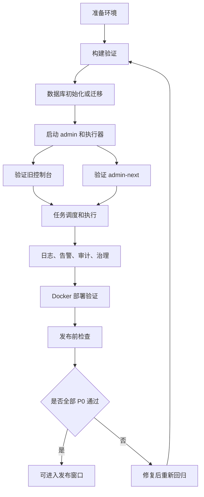
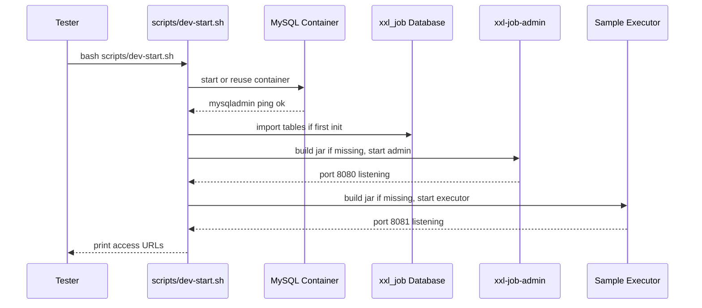
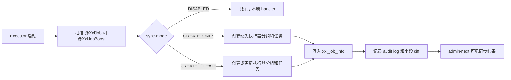
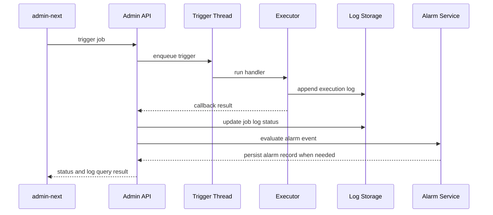
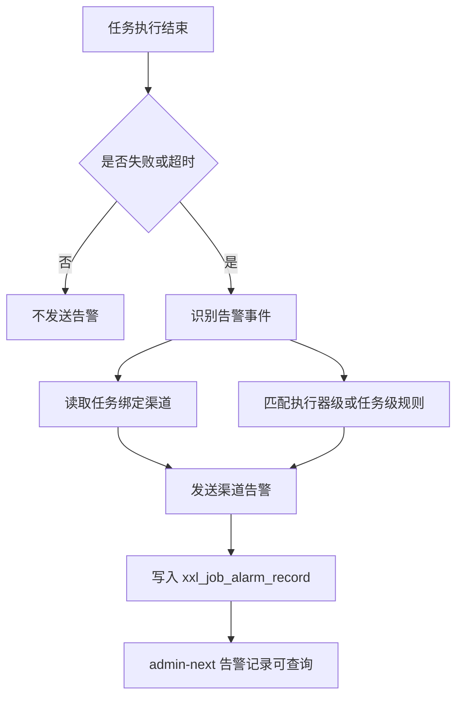
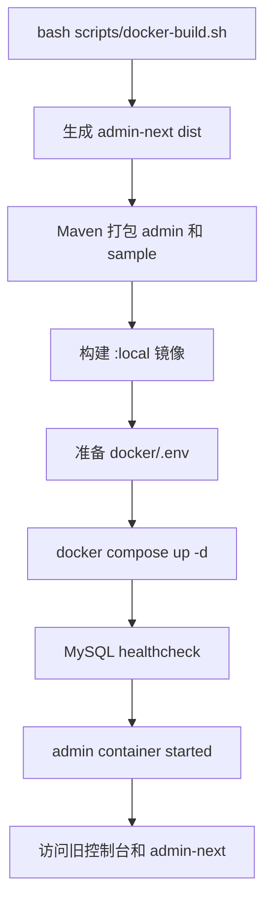
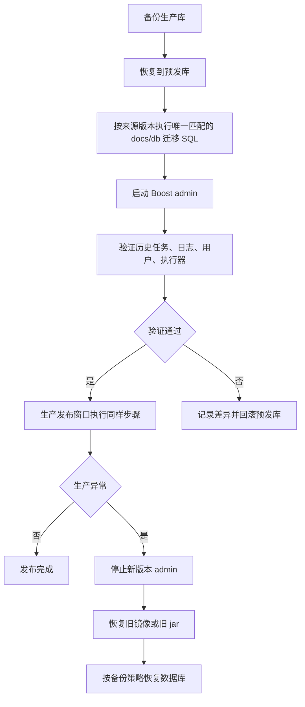

# XXL-JOB Boost 1.0.0 测试用例

本文档用于 `1.0.0` 发布前自测、预发验收和生产上线前复核。测试目标不是穷举所有上游 XXL-JOB 能力，而是覆盖 Boost 当前新增和改造过的高风险链路。

## 测试范围

### 必测范围

- 本地脚本启动、停止、状态检查。
- 前端生产构建、后端 Maven 构建、Docker 镜像构建。
- 旧控制台和 `admin-next` 双入口。
- 执行器注册、任务同步、任务触发、日志查看、终止执行。
- 告警渠道、执行器默认策略、任务告警覆盖、告警记录。
- 审计日志、失败聚合、慢任务分析、治理总览。
- 数据库初始化、旧库迁移、重复执行迁移。
- Maven Central release profile 验证。
- Docker 部署与生产配置检查。

### 非本轮强制范围

- 超大规模压测。
- 多租户权限模型。
- 第三方告警平台的真实生产发送稳定性。
- 所有上游 XXL-JOB 历史版本的跨版本升级验证。
- 业务执行器接入方的业务逻辑正确性。

## 测试环境

| 环境 | 用途 | 必备组件 |
| --- | --- | --- |
| 本地开发环境 | 快速验证脚本、UI、任务执行 | JDK 17+、Maven、Docker、Node.js 20.19+、pnpm 10.5+ |
| 预发环境 | 贴近生产的完整演练 | 独立 MySQL、生产同类镜像、真实配置副本 |
| 生产发布前只读检查 | 发布窗口前确认 | 数据库备份、镜像版本、配置、回滚包 |

默认入口：

| 入口 | 地址 |
| --- | --- |
| 旧控制台 | `http://127.0.0.1:8080/xxl-job-admin/` |
| 新控制台 | `http://127.0.0.1:8080/xxl-job-admin/admin-next/` |
| 前端开发服务 | `http://127.0.0.1:5173/` |
| 样例执行器 | `http://127.0.0.1:8081/` |

默认账号：

| 用户名 | 密码 |
| --- | --- |
| `admin` | `123456` |

## 优先级定义

| 优先级 | 含义 | 发布要求 |
| --- | --- | --- |
| P0 | 发布阻塞项 | 必须全部通过 |
| P1 | 核心回归项 | 推荐全部通过，失败要明确是否可接受 |
| P2 | 扩展体验项 | 可延后，但要记录风险 |

## 总体测试流程



## 发布准入清单

| 编号 | 检查项 | 命令或入口 | 期望结果 | 优先级 |
| --- | --- | --- | --- | --- |
| GA-001 | Git 工作区干净 | `git status --short --branch` | 无未提交变更，分支同步远端 | P0 |
| GA-002 | 前端生产构建 | `bash scripts/docker-build.sh` | `vite build` 成功，`xxl-job-admin-ui/dist` 产物生成 | P0 |
| GA-003 | 后端应用打包 | `bash scripts/docker-build.sh` | `xxl-job-admin-1.0.0.jar` 和 sample jar 生成 | P0 |
| GA-004 | Docker 本地镜像构建 | `bash scripts/docker-build.sh` | `pub.lighting/xxl-job-boost-admin:local` 构建成功 | P0 |
| GA-005 | Maven release profile | `JAVA_HOME=/path/to/jdk17 mvn -P release -DskipTests -Dgpg.skip=true verify` | 只构建 7 个库模块并成功生成 sources/javadocs | P0 |
| GA-006 | 脚本语法检查 | `bash -n scripts/*.sh` | 无语法错误 | P0 |
| GA-007 | 迁移 SQL 幂等性 | 在匹配的官方测试库重复执行同一份 `docs/db/migrate-from-official-*.sql` | 第 2 次执行仍成功 | P0 |
| GA-008 | 生产配置已替换默认值 | 检查 `.env`、数据库连接、`accessToken` | 不使用默认密码和本地路径 | P0 |
| GA-009 | 回滚材料可用 | 旧镜像、旧 jar、数据库备份 | 可在发布窗口内回退 | P0 |

## 本地运行测试

### 启动流程



| 编号 | 用例 | 前置条件 | 步骤 | 期望结果 | 优先级 |
| --- | --- | --- | --- | --- | --- |
| LR-001 | 一键启动本地环境 | Docker 可用，端口未被非项目进程占用 | 执行 `bash scripts/dev-start.sh` | MySQL、admin、sample executor 均启动成功 | P0 |
| LR-002 | 重复启动幂等 | 已执行过 `dev-start.sh` | 再次执行 `bash scripts/dev-start.sh` | 不重复初始化或修改现有数据；服务可用 | P0 |
| LR-003 | 查看状态 | 本地环境已启动 | 执行 `bash scripts/dev-status.sh` | 显示 admin、executor、mysql running，端口 listening | P0 |
| LR-004 | 停止环境 | 本地环境已启动 | 执行 `bash scripts/dev-stop.sh` | admin、executor、MySQL 容器停止或状态明确 | P0 |
| LR-005 | 端口冲突保护 | 用非项目进程占用 `8080` | 执行 `bash scripts/dev-start.sh` | 脚本失败并提示非 XXL-JOB 进程占用，不误杀 | P0 |
| LR-006 | 缺少 jar 自动构建 | 删除 admin/sample target jar | 执行 `bash scripts/dev-start.sh` | 自动 Maven 打包并启动 | P1 |
| LR-007 | JDK 版本兜底 | 当前 shell 默认 Java 低于 17，但本机有 JDK 17 | 执行 `bash scripts/dev-start.sh` | 脚本选择 JDK 17，构建不报 `target release 17` | P1 |
| LR-008 | 日志目录生成 | 本地环境启动后 | 查看 `/tmp/xxl-job-runtime-logs` 和 `/tmp/xxl-job-boost-run` | 目录和服务日志文件存在 | P1 |

## 登录与基础导航

| 编号 | 用例 | 前置条件 | 步骤 | 期望结果 | 优先级 |
| --- | --- | --- | --- | --- | --- |
| UI-001 | 旧控制台登录 | admin 已启动 | 打开 `/xxl-job-admin/`，用 `admin/123456` 登录 | 登录成功，Dashboard 可见 | P0 |
| UI-002 | 新控制台登录 | admin 已启动 | 打开 `/xxl-job-admin/admin-next/`，用 `admin/123456` 登录 | 登录成功，首页数据加载 | P0 |
| UI-003 | 新旧入口并存 | 已登录 | 分别访问旧入口和新入口 | 两个入口均可访问，不互相破坏 session | P0 |
| UI-004 | 刷新 SPA 子页面 | 已登录新控制台 | 进入任务页或日志页后刷新浏览器 | 页面不 404，路由恢复 | P0 |
| UI-005 | 未登录拦截 | 清理登录态 | 直接访问新控制台任意内页 | 跳转到登录页或提示未登录 | P1 |
| UI-006 | 菜单可达性 | 已登录新控制台 | 逐项点击 Dashboard、执行器、任务、日志、用户、告警、治理、审计 | 页面都能打开，API 无 404 | P0 |
| UI-007 | 移动端基础展示 | 浏览器切到窄屏 | 访问登录页、任务页、日志页 | 内容不严重遮挡，核心操作可达 | P2 |

## 执行器与任务同步

### 同步流程



| 编号 | 用例 | 前置条件 | 步骤 | 期望结果 | 优先级 |
| --- | --- | --- | --- | --- | --- |
| JS-001 | 样例执行器自动注册 | 本地环境启动 | 新控制台进入执行器页 | `xxl-job-executor-sample` 在线，地址可见 | P0 |
| JS-002 | `@XxlJobBoost` 任务自动同步 | sample executor 启动 | 查看任务列表或任务树 | 示例任务存在，handler、负责人、调度配置正确 | P0 |
| JS-003 | `CREATE_UPDATE` 更新任务元数据 | 修改 sample 注解中的描述或标签后重启 executor | 查看任务详情和审计日志 | 任务更新，审计记录包含同步动作 | P1 |
| JS-004 | `CREATE_ONLY` 不覆盖已有任务 | 配置 sync-mode 为 `CREATE_ONLY`，手工改任务描述，再重启 | 查看任务详情 | 已有任务描述不被覆盖 | P1 |
| JS-005 | `DISABLED` 不同步任务 | 配置 sync-mode 为 `DISABLED` 后启动新 handler | 查看任务列表 | 不创建 Boost 元数据任务，只注册本地 handler | P1 |
| JS-006 | 执行器分组自动创建 | 删除样例执行器分组后重启 executor | 查看执行器页 | 分组按 appname 和 group-title 自动创建 | P1 |
| JS-007 | 仅 `@XxlJobBoost` handler | 使用只有 `@XxlJobBoost` 的样例 | 启动 executor 并查看任务 | handler 正常注册，任务同步成功 | P1 |
| JS-008 | 空 handler 名称校验 | 构造 `@XxlJobBoost(value="")` | 启动 executor | 启动失败或明确报错，避免同步无效任务 | P1 |

## 任务日常操作

### 执行链路



| 编号 | 用例 | 前置条件 | 步骤 | 期望结果 | 优先级 |
| --- | --- | --- | --- | --- | --- |
| JO-001 | 手动触发任务 | 样例任务存在 | 在新控制台触发 `demoJobHandler` | 返回成功，日志列表出现新记录 | P0 |
| JO-002 | Cron 启动和停止 | 任务有合法 Cron | 点击启动，等待触发，再点击停止 | `trigger_status` 状态正确，停止后不再触发 | P0 |
| JO-003 | 修改任务基础信息 | 已登录管理员 | 修改描述、负责人、标签、参数后保存 | 保存成功，刷新后仍存在 | P0 |
| JO-004 | 复制任务 | 已有任务 | 点击复制并保存为新任务 | 新任务创建成功，字段合理复制 | P1 |
| JO-005 | 删除任务 | 创建测试任务 | 删除测试任务 | 任务从列表消失，相关操作有审计 | P1 |
| JO-006 | 任务树筛选 | 有多个执行器或标签 | 按执行器、标签、关键词筛选 | 列表和树节点结果一致 | P1 |
| JO-007 | 非法 Cron 校验 | 编辑任务 Cron 为非法值 | 保存或启动 | 前端或后端拒绝，提示明确 | P0 |
| JO-008 | 超时任务 | 创建会 sleep 超过 timeout 的 handler | 手动触发 | 日志状态为失败或超时，告警事件可识别 | P1 |
| JO-009 | 失败重试 | 配置失败重试次数 | 触发必失败 handler | 触发次数符合配置，最终状态正确 | P1 |
| JO-010 | 阻塞策略 | 创建长时间运行任务并连续触发 | 分别测试串行、丢弃、覆盖策略 | 行为符合策略定义 | P1 |
| JO-011 | 子任务 | 配置父任务 child_jobid | 触发父任务 | 父任务成功后子任务被触发 | P2 |

## 日志与 GLUE

| 编号 | 用例 | 前置条件 | 步骤 | 期望结果 | 优先级 |
| --- | --- | --- | --- | --- | --- |
| LG-001 | 日志列表查询 | 已执行过任务 | 进入日志页，按执行器、任务、状态筛选 | 查询结果正确，分页正常 | P0 |
| LG-002 | 滚动日志详情 | 有执行日志 | 打开日志详情 | 能看到调度日志和执行日志 | P0 |
| LG-003 | 终止运行中任务 | 触发长运行任务 | 在日志页点击终止 | 执行器收到 kill，日志状态更新 | P1 |
| LG-004 | 业务 Logback 捕获 | 开启 `log-capture.enabled=true` | 触发输出 logger 的任务 | 业务日志出现在 XXL-JOB 执行日志 | P1 |
| LG-005 | 日志捕获限流 | 配置较小 `max-events-per-job` | 触发高频日志任务 | 日志不会无限增长，截断行为可接受 | P2 |
| LG-006 | GLUE 代码查看 | 存在 GLUE 任务 | 进入 GLUE 页面 | 代码内容加载成功 | P1 |
| LG-007 | GLUE 保存和历史版本 | 修改 GLUE 代码并保存 | 切换历史版本 | 新版本可见，历史版本可回看 | P1 |

## 告警测试

### 告警链路



| 编号 | 用例 | 前置条件 | 步骤 | 期望结果 | 优先级 |
| --- | --- | --- | --- | --- | --- |
| AL-001 | 新增 Webhook 渠道 | 已登录管理员 | 新增 `WEBHOOK` 渠道，填本地 mock endpoint | 保存成功，列表可见 | P0 |
| AL-002 | 编辑告警渠道 | 已有渠道 | 修改名称、启用状态、备注 | 保存成功，刷新后保持 | P1 |
| AL-003 | 禁用渠道不发送 | 渠道已禁用 | 触发失败任务 | 不向该渠道发送，记录行为符合实现 | P1 |
| AL-004 | 任务绑定告警渠道 | 已有渠道和任务 | 在任务中绑定 `alarm_channel_ids` 和失败事件 | 触发失败后生成告警记录 | P0 |
| AL-005 | 执行器默认告警策略 | 在执行器管理中配置默认策略 | 触发该执行器下未配置任务告警的失败任务 | 继承默认策略并发送告警 | P0 |
| AL-006 | 任务告警覆盖默认策略 | 同时存在执行器默认策略和任务告警配置 | 触发指定任务失败 | 只按任务配置发送，不叠加执行器默认策略 | P0 |
| AL-007 | 超时事件告警 | 任务 timeout 小于执行时间 | 触发任务 | 生成 `EXECUTOR_TIMEOUT` 告警记录 | P1 |
| AL-008 | 触发失败事件告警 | 配置不可达执行器地址 | 手动触发任务 | 生成 `TRIGGER_FAIL` 告警记录 | P1 |
| AL-009 | Webhook 返回失败 | mock endpoint 返回 500 | 触发失败任务 | 告警记录 `send_status` 为失败，保存响应码和错误信息 | P0 |
| AL-010 | 邮件告警兼容 | 配置 `alarm_email` 和邮件参数 | 触发失败任务 | 原有邮件链路仍可用或失败原因明确 | P1 |
| AL-011 | 告警记录筛选 | 已产生多条记录 | 按执行器、渠道类型、状态筛选 | 结果正确，分页正常 | P1 |

## 审计与治理

| 编号 | 用例 | 前置条件 | 步骤 | 期望结果 | 优先级 |
| --- | --- | --- | --- | --- | --- |
| AU-001 | 任务操作审计 | 新增、编辑、启动、停止、删除测试任务 | 查看审计日志 | 每类操作均有记录，operator、resource、action 正确 | P0 |
| AU-002 | 执行器操作审计 | 新增或编辑执行器 | 查看审计日志 | 记录执行器资源和操作人 | P1 |
| AU-003 | 用户操作审计 | 新增普通用户并修改权限 | 查看审计日志 | 用户相关操作入库 | P1 |
| AU-004 | 告警操作审计 | 新增、编辑、删除渠道和规则 | 查看审计日志 | 告警资源操作入库 | P1 |
| AU-005 | 自动同步审计 | 重启 sample executor 触发同步 | 查看审计日志 | 来源为 executor-sync 或系统来源，diff 可读 | P0 |
| AU-006 | 审计筛选 | 存在不同类型审计 | 按操作人、动作、资源类型、执行器筛选 | 结果正确，分页正常 | P1 |
| GV-001 | 治理总览加载 | 存在任务和日志 | 打开治理总览 | 总任务、有负责人、有标签、审计数加载成功 | P0 |
| GV-002 | 失败聚合 | 产生失败任务日志 | 打开失败聚合页 | Top 失败任务统计正确 | P1 |
| GV-003 | 慢任务分析 | 产生长耗时日志 | 打开慢任务页 | 慢任务排序和耗时显示合理 | P1 |

## 用户与权限

| 编号 | 用例 | 前置条件 | 步骤 | 期望结果 | 优先级 |
| --- | --- | --- | --- | --- | --- |
| AC-001 | 新增普通用户 | 管理员登录 | 新增普通用户并设置执行器权限 | 用户可登录，仅看到授权执行器 | P0 |
| AC-002 | 普通用户越权访问 | 普通用户登录 | 尝试访问未授权执行器任务 | 列表不可见或操作被拒绝 | P0 |
| AC-003 | 修改密码 | 普通用户或管理员 | 修改密码后重新登录 | 新密码可用，旧密码不可用 | P1 |
| AC-004 | 删除用户 | 管理员登录 | 删除测试用户 | 用户无法再登录 | P1 |
| AC-005 | 新控制台和旧控制台权限一致 | 同一个普通用户分别登录新旧控制台 | 查看执行器和任务 | 权限边界一致 | P1 |

## Docker 部署测试

### 部署流程



| 编号 | 用例 | 前置条件 | 步骤 | 期望结果 | 优先级 |
| --- | --- | --- | --- | --- | --- |
| DK-001 | 构建本地镜像 | Docker 可用 | 执行 `bash scripts/docker-build.sh` | admin 和 sample 镜像构建成功 | P0 |
| DK-002 | Compose 启动 | 镜像已构建，`.env` 合法 | 执行 `docker compose -f docker/docker-compose.yml up -d` | MySQL healthy，admin 启动 | P0 |
| DK-003 | 容器内 admin-next 静态资源 | Compose 已启动 | 访问 `/xxl-job-admin/admin-next/` | 页面加载的是当前构建产物 | P0 |
| DK-004 | 容器环境变量传递 | Compose 已启动 | 查看容器启动参数和连接库 | 数据库 URL、context path、端口符合 `.env` | P1 |
| DK-005 | 容器重启 | Compose 已启动 | `docker restart xxl-job-admin` | admin 恢复，数据不丢 | P1 |
| DK-006 | MySQL 数据持久化 | Compose 已启动并创建测试任务 | `docker compose down` 后再 `up -d` | 测试任务仍存在 | P0 |
| DK-007 | 不启动样例执行器的生产模式 | 修改 compose 或生产部署只启动 admin | 启动 admin | admin 可用，未误依赖 sample executor | P1 |
| DK-008 | 镜像打标 | 本地镜像存在 | 执行 tag 命令到 `1.0.0` | 版本标签存在，sha 与 local 一致 | P1 |

## 数据库迁移测试

### 迁移和回滚流程



| 编号 | 用例 | 前置条件 | 步骤 | 期望结果 | 优先级 |
| --- | --- | --- | --- | --- | --- |
| DB-001 | 全新初始化 | 空 MySQL | 导入 `docs/db/install-xxl-job-boost.sql` | 所有基础表、Boost 表、默认用户创建成功 | P0 |
| DB-002 | 官方库迁移幂等性 | 官方 3.4.2 或 2.4.x/2.5.x 测试库 | 对匹配来源版本的迁移 SQL 连续执行两次 | 两次都成功，无重复列或索引错误 | P0 |
| DB-003 | 旧库补齐 Boost 字段 | 模拟旧库 `xxl_job_info` 缺少 Boost 字段 | 执行迁移 | `job_tag`、`alarm_channel_ids`、`alarm_event_types` 存在 | P0 |
| DB-004 | 创建告警表 | 旧库缺少告警表 | 执行迁移 | `xxl_job_alarm_channel/rule/record` 存在 | P0 |
| DB-005 | 创建审计表 | 旧库缺少审计表 | 执行迁移 | `xxl_job_audit_log` 和 `operator_user_id` 存在 | P0 |
| DB-006 | 历史数据保留 | 预发库包含真实任务、用户、日志 | 执行迁移后启动 admin | 历史任务、用户、执行器和日志仍可查 | P0 |
| DB-007 | 字符集兼容 | 任务描述包含中文、特殊字符 | 迁移并查看页面 | 中文不乱码 | P1 |
| DB-008 | 大表迁移耗时 | 日志表较大 | 在预发库执行迁移并记录耗时 | 可接受；生产窗口有足够时间 | P1 |
| DB-009 | 回滚验证 | 已备份数据库和旧镜像 | 模拟发布失败后恢复 | 旧版本可启动，核心数据可用 | P0 |

## Maven Central 发布验证

| 编号 | 用例 | 前置条件 | 步骤 | 期望结果 | 优先级 |
| --- | --- | --- | --- | --- | --- |
| MV-001 | release profile 模块边界 | JDK 17 | 执行 `mvn -P release -DskipTests -Dgpg.skip=true verify` | 只构建根 POM 和 6 个库模块，不包含 admin/sample | P0 |
| MV-002 | sources jar | MV-001 通过 | 查看各库模块 `target/*-sources.jar` | 文件存在 | P0 |
| MV-003 | javadoc jar | MV-001 通过 | 查看各库模块 `target/*-javadoc.jar` | 文件存在 | P0 |
| MV-004 | GPG 正式签名 | 配好 GPG key 和 passphrase | 执行不带 `-Dgpg.skip=true` 的 release verify | `.asc` 签名生成 | P0 |
| MV-005 | Central 凭据 | Maven `settings.xml` 有 `central` server | 执行正式 publish | Central Portal 创建 deployment | P0 |
| MV-006 | 坐标可解析 | Central 发布完成后 | 新建空项目引入 `pub.lighting:xxl-job-boost-spring-boot-starter:1.0.0` | Maven 能解析依赖 | P0 |
| MV-007 | 外部依赖不被错误改名 | 发布后检查依赖树 | `mvn dependency:tree` | `xxl-tool` 和 `xxl-sso-core` 仍来自 `com.xuxueli` | P1 |

## 生产发布前检查

| 编号 | 用例 | 前置条件 | 步骤 | 期望结果 | 优先级 |
| --- | --- | --- | --- | --- | --- |
| PR-001 | 版本一致性 | 准备发布 | 检查 README、POM、镜像 tag、Git tag | 都是 `1.0.0` | P0 |
| PR-002 | 配置去默认值 | 准备生产 `.env` 或部署配置 | 检查密码、token、路径、端口 | 不使用 `root_pwd`、`123456` 以外的生产初始风险值 | P0 |
| PR-003 | 数据库备份 | 发布窗口前 | 执行并校验备份 | 备份可恢复，备份文件可访问 | P0 |
| PR-004 | 镜像拉取 | 目标生产机器 | `docker pull <admin-image>:1.0.0` | 拉取成功，digest 记录到发布单 | P0 |
| PR-005 | 健康检查 | 部署后 | 访问旧控制台、新控制台和核心 API | 返回正常 | P0 |
| PR-006 | 日志可观测 | 部署后 | 查看容器日志和应用日志目录 | 错误日志无持续刷屏 | P0 |
| PR-007 | 权限账号 | 部署后 | 管理员和普通用户登录 | 账号权限符合预期 | P0 |
| PR-008 | 告警通道 | 部署后 | 触发测试告警 | 能收到或明确记录失败原因 | P1 |
| PR-009 | 执行器兼容 | 部署后 | 观察已有执行器注册和任务执行 | 旧执行器不需要立刻升级也能运行 | P0 |

## 异常与故障注入

| 编号 | 用例 | 故障注入 | 步骤 | 期望结果 | 优先级 |
| --- | --- | --- | --- | --- | --- |
| FI-001 | MySQL 不可用 | 停止 MySQL | 启动 admin 或访问页面 | admin 启动失败或接口报错明确，不出现静默成功 | P0 |
| FI-002 | 执行器离线 | 停止 sample executor | 手动触发任务 | 触发失败，日志和告警记录正确 | P0 |
| FI-003 | Webhook 慢响应 | mock endpoint sleep 超过超时 | 触发告警 | 告警发送失败可记录，不阻塞调度线程过久 | P1 |
| FI-004 | 磁盘日志目录不可写 | 将日志目录设为不可写 | 触发任务 | 错误明确，服务不崩溃或有可恢复路径 | P1 |
| FI-005 | admin 重启中触发任务 | 重启 admin | 观察执行器注册和任务状态 | admin 恢复后执行器重新注册，任务状态可查 | P1 |
| FI-006 | 浏览器刷新和接口 401 | 清理 cookie 或 session | 刷新新控制台页面 | 跳转登录，不出现空白页 | P1 |

## 安全与配置检查

| 编号 | 用例 | 检查方式 | 期望结果 | 优先级 |
| --- | --- | --- | --- | --- |
| SC-001 | 默认密码处理 | 生产配置审查 | 生产不保留默认 `admin/123456` | P0 |
| SC-002 | accessToken | 检查 admin 和 executor 配置 | 生产 token 非空且两端一致 | P0 |
| SC-003 | 数据库密码 | 检查 compose、env、配置中心 | 不使用示例密码，不提交真实密码 | P0 |
| SC-004 | Webhook 密钥 | 检查告警渠道配置 | secret 不暴露在日志或页面非授权区域 | P1 |
| SC-005 | 普通用户权限 | 普通用户登录测试 | 不可管理未授权执行器和用户 | P0 |
| SC-006 | 容器端口暴露 | 检查生产网络 | 只暴露必要端口，MySQL 不公网暴露 | P0 |

## 兼容性测试

| 编号 | 用例 | 前置条件 | 步骤 | 期望结果 | 优先级 |
| --- | --- | --- | --- | --- | --- |
| CP-001 | 旧 Netty 执行器兼容 | 使用 `NETTY_EMBED` 执行器 | 启动并触发任务 | 注册、触发、回调、日志正常 | P0 |
| CP-002 | Spring HTTP 执行器 | 使用 Boost starter 默认配置 | 启动并触发任务 | 复用 `server.port`，无额外 Netty 端口依赖 | P0 |
| CP-003 | 无显式客户端前缀地址 | 执行器地址使用普通 `http://host:port/`，不带 `HTTP::` | 调度触发 | transport factory 可正确匹配 | P1 |
| CP-004 | 旧控制台任务操作 | 旧控制台新增或编辑任务 | 新控制台查看 | 数据一致 | P0 |
| CP-005 | 新控制台任务操作 | 新控制台新增或编辑任务 | 旧控制台查看 | 数据一致 | P0 |
| CP-006 | 官方旧库升级 | 官方 3.x 库副本 | 执行迁移并部署 Boost | 历史任务和执行器可用 | P0 |

## 测试记录模板

| 字段 | 内容 |
| --- | --- |
| 测试日期 |  |
| 测试人 |  |
| Git commit |  |
| 镜像 tag 或 jar 版本 |  |
| 数据库来源 | 全新库 / 旧库副本 / 生产副本 |
| 通过用例 |  |
| 失败用例 |  |
| 阻塞问题 |  |
| 是否允许发布 | 是 / 否 |

## 发布结论模板

```text
结论：允许 / 不允许发布 XXL-JOB Boost 1.0.0。

P0：通过 x 项，失败 x 项。
P1：通过 x 项，失败 x 项，延期 x 项。
P2：通过 x 项，失败 x 项，延期 x 项。

剩余风险：
1. 
2. 

回滚材料：
1. 数据库备份：
2. 旧镜像或旧 jar：
3. 配置备份：
```
